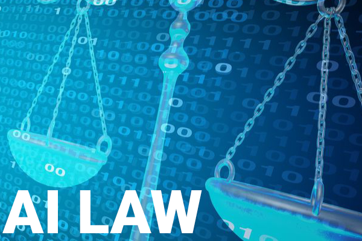

# Module 1: Case Study of ROSS Intelligence, Inc.

## Contents

- [Overview and Origin](https://github.com/bychok/ai-case-study?tab=readme-ov-file#overview-and-origin)
- [Business Activities](https://github.com/bychok/ai-case-study?tab=readme-ov-file#business-activities)
- [Landscape](https://github.com/bychok/ai-case-study?tab=readme-ov-file#landscape)
- [Results](https://github.com/bychok/ai-case-study?tab=readme-ov-file#results)
- [Recommendations](https://github.com/bychok/ai-case-study?tab=readme-ov-file#recommendations)
- [Notes](https://github.com/bychok/ai-case-study?tab=readme-ov-file#notes)

## Overview and Origin

- **Name of company**: ROSS Intelligence, Inc.
- **When was the company incorporated?**: March 12, 2015.
- **Who are the founders of the company?**: Andrew Arruda, Jimoh Ovbiagele, and Pargles Dall’Oglio.
- **How did the idea for the company (or project) come about?**: The founders sought to leverage AI to revolutionize the cumbersome and time-intensive process of legal research.
- **How is the company funded? How much funding have they received?**: ROSS Intelligence has secured funding through various rounds, specifics of which can be tracked on [Crunchbase](https://www.crunchbase.com/organization/ross-intelligence).

## Business Activities

- **What specific problem is the company or project trying to solve?**: Streamlining and enhancing the efficiency of legal research.
- **Who is the company's intended customer?**: Legal professionals, law firms, and law schools.
- **What solution does this company offer that their competitors do not or cannot offer?**: Advanced NLP for more accurate and contextually relevant search results.
- **Which technologies are they currently using and how are they implementing them?**: AI, particularly NLP and machine learning, for parsing and understanding legal documents and queries.

## Landscape

The legal tech field is at an inflection point, with AI-driven solutions transforming traditional practices. Over the last 5–10 years, trends have included automation of routine tasks, data analytics for predictive insights, and AI for legal research and case management.

ROSS Intelligence was a leader in this evolving landscape, offering cutting-edge solutions for legal research. Their technology stands out for its ability to understand natural language queries, making legal research more intuitive and efficient.

Competitors like [Thomson Reuters Westlaw](https://legal.thomsonreuters.com/en/products/westlaw) and [LexisNexis](https://www.lexisnexis.com/en-us/home.page) have also integrated AI into their services but often rely on more traditional search methodologies. This sets ROSS apart, highlighting its innovative approach to leveraging AI for legal research.

## Results

ROSS Intelligence has significantly impacted the legal research process, offering a faster, more accurate alternative to traditional methods. Metrics for success in this space include user adoption rates, customer satisfaction, and time savings, where ROSS has shown promising results.

Compared to its competitors, ROSS's AI-driven approach has not only improved efficiency but also increased the accessibility of comprehensive legal research, establishing it as a notable innovator in legal tech. As a result, in the spring of 2020, Thomson Reuters and Westlaw brought a lawsuit against ROSS. Litigation is expensive, so the company had to stop taking on new clients as of [January 31, 2021](https://blog.rossintelligence.com/post/announcement).

## Recommendations

To further solidify its position, ROSS Intelligence could have explored expanding its AI capabilities to predictive analytics, offering predictions on case outcomes based on historical data. It could have created a generative AI to provide comprehensive insights into the decision-making patterns of judges — based not just on their written rulings, but also their rulings from the bench. This would not only enhance its current offerings but also provide legal professionals with powerful tools for case preparation and strategy development. They also need a large legal fund to protect themselves from their litigious competitors.

---

## Notes

ChatGPT4 (April 2023 update) was used to generate this case study. The instructions for Module 1 were added to a word document and uploaded to ChatGPT. The following prompt was used:

> Based on the criteria found in the Requirements section of this document, draft a case study of a company of your choosing that is adding AI to the legal sphere. Make sure to format your response as outlined in Instructions Part 2: Conduct your Research Using the Case Study Template as a Guide of the provided document. Get straight to the point, the reader has many case studies to read.

Initially, ChatGPT refused to provide any links. So the following prompt was added:

> Yes, you can provide links. Redo the prompt above.

Afterwards, ChatGPT's information was double checked. Surprisingly, the date of the incorporation of ROSS Intelligence was properly listed as 2015, as it appears in Delaware's Division of Corps. [website](https://icis.corp.delaware.gov/Ecorp/EntitySearch/), despite the company's own About page incorrectly stating the company was founded in 2014, [Ross Intelligence: Our Story](https://www.rossintelligence.com/about-us).

ChatGPT also properly listed that the top AI competitors in the legal field were Thompson Reuters' Westlaw and LexisNexis. It failed, however, to state that as of [January 31, 2021](https://blog.rossintelligence.com/post/announcement) ROSS has not been taking on new clients due to a lawsuit its competitors brought against the company in the spring of 2020.

ChatGPT also correctly listed the three original founders of ROSS Intelligence, despite the company currently stating it was only founded by [Andrew Arruda and Jimoh Ovbiagele](https://www.rossintelligence.com/about-us). The third founder, Pargles Dall’Oglio, states in his [Linkedin](https://ca.linkedin.com/in/pargles) profile that he is "Founder @ ROSS".

The rest of the text is accurate based on my knowledge of the legal industry as a practicing attorney. It was surprising ChatGPT chose a non-active company to do a case study on, but I am glad it did so because this case study shows that no matter how good your product is, if you do not have large cash reserves, your competitors can bankrupt you through lawsuits.
